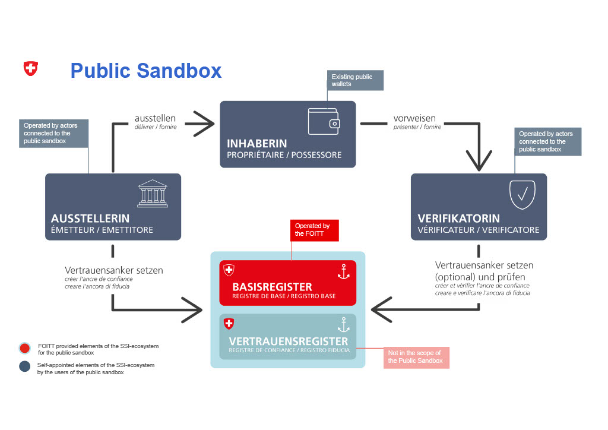
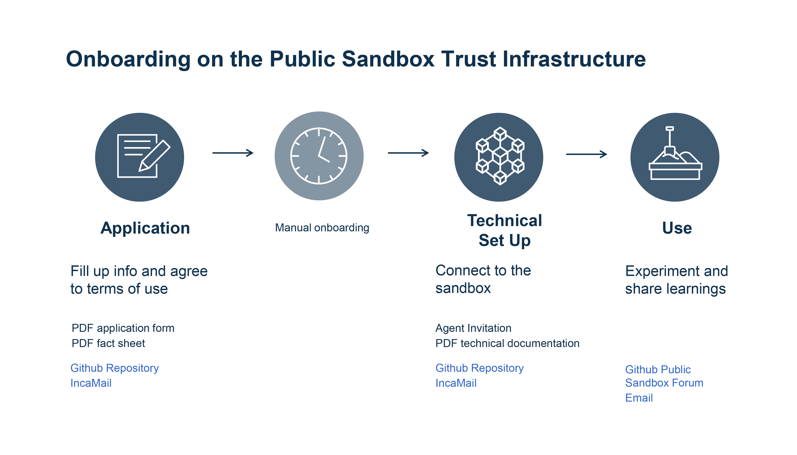

# Welcome to the Public Sandbox Trust Infrastructure
**

## Update regarding Public Beta
In Q1 2025, the Public Sandbox Trust Infastructure will be replaced by a new integration environment (Public Beta). It will be based on the technologies that will be used for the initial productive implementation of the E-ID and its trust-infrastructure. This factsheet provides further information. Additional information will follow.
https://backend.eid.admin.ch/fileservice/sdweb-docs-prod-eidch-files/files/2024/09/19/d6944976-2e80-4bdd-9f73-ba4e0638396e.pdf

## What's the Public Sandbox Trust Infrastructure?
The "Public Sandbox Trust Infrastructure" is an isolated test area and pilot operation on the Trust Infrastructure currently being built by the Swiss Confederation to support the Swiss digital identity (E-ID) and its necessary Self-Sovereign Identity (SSI) ecosystem.

In order to enable the emergence of the ecosystem, the "Public Sandbox Trust Infrastructure" is made available until the end of 2024, to every public and private institution in Switzerland willing to conduct on it their own SSI-Pilots and thus experiment and learn hand in hand with the Swiss Government. The objective of this initiative is to gain experience on the potential processes and technical elements around the E-ID and the underlying trust infrastructure.

For an insight of the ledger please consult the [Indy Scan](https://explorer.sandbox.ssi.ch/).

If you and your institution are interested in joining the adventure, download and read the above available documents and **return the filled and signed application form via  [IncaMail](https://www.incamail.com/) to ssi-sandbox@bit.admin.ch.**

#### How to apply to the Sandbox?

1. Complete and return the form signed by all parties via [IncaMail](https://www.incamail.com/) to ssi-sandbox@bit.admin.ch  
*You will need various technical information such as: Issuer and Owner identificators (Indy DID) and public keys (verkey)*
3. Wait  
*You will receive an application confirmation*
5. Access to the base registry thanks to the received agent invitation
6. Run your own pilots and give us feedback on GitHub Discussions or via email.

- - - -

## Getting started
If you're not yet completely acquainted with our technology stack, or if you're unsure about how to create the necessary data for your
Public Sandbox Trust Infrastructure application, we've created a [Cookbook](cookbook) for your convenience. This guide outlines the crucial steps you need
to take to establish your setup and enable yourself to issue verifiable credentials. In addition, it includes a collection of beneficial links 
as useful resources for understanding the technology and its associated concepts.

## Ground rules
You will find everything about the participation and data management rules in the fact sheet and in the application form. Main rules are:

* the responsibility for the data is imputed to the participants 
* every actively* involved party in a participant's business case must read the conditions and co-sign the form with full knowledge  
*(\* actors transforming data)*

The Public Sandbox Trust Infrastructure can currently only accommodate a limited number of participants, there are still a number of spaces available.

Support will be provided in German or in English during the office hours on a best effort basis.

## Support
For technical support please contact us via ssi-sandbox@bit.admin.ch
