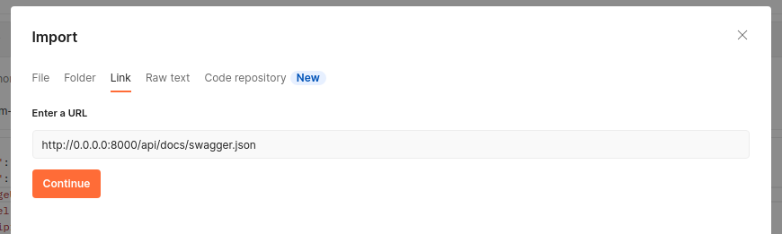
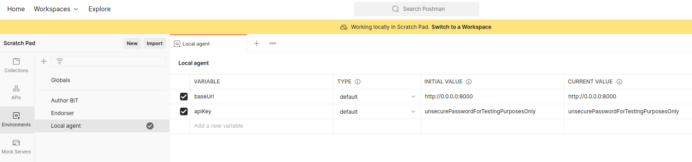
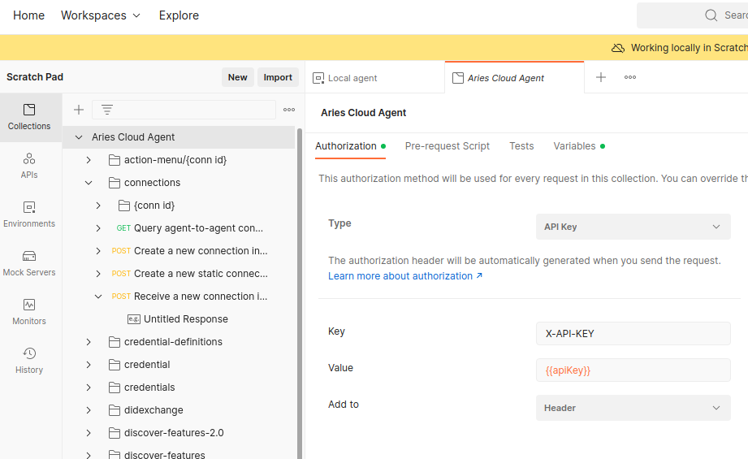

# How to use the public sandbox with your own agent


This documentation will show you how to create a DID and connect your issuing agent to the endorser of the FOITT (Federal Office of Information Technology, Systems and Telecommunication)

> **New to Self-Sovereign Identity (SSI) or the tech stack?**   
> If you're just starting in the SSI field, the following course might help you to understand the basic concepts and building blocks
> - edX [Getting Started with Self-Sovereign Identity](https://www.edx.org/course/getting-started-with-self-sovereign-identity)
>
> If you already possess a firm grasp on SSI's underlying principles, the following ressources might help you to delve into the tech stack of the Public Sandbox Trust Infrastructure
> - GitHub [Getting started with Aries](https://github.com/hyperledger/aries-cloudagent-python/blob/main/docs/GettingStartedAriesDev/README.md)
> - edX [Introduction to Hyperledger SSI Blockchain solutions](https://www.edx.org/course/identity-in-hyperledger-aries-indy-and-ursa)
> - edX [Becoming a Hyperledger Aries Developer](https://www.edx.org/course/becoming-a-hyperledger-aries-developer)
> - Hyperledger [Aries](https://wiki.hyperledger.org/display/ARIES/Hyperledger+Aries)

<!-- TOC -->
* [How to use the public sandbox with your own agent](#how-to-use-the-public-sandbox-with-your-own-agent)
  * [About this setup](#about-this-setup)
  * [Before applying](#before-applying)
    * [Generate DID without providing a seed](#generate-did-without-providing-a-seed)
      * [1. Start issuer](#1-start-issuer)
      * [2. Generate DID](#2-generate-did)
    * [Alternative variant: Generate DID by providing a seed](#alternative-variant-generate-did-by-providing-a-seed)
      * [1. Generate seed](#1-generate-seed)
      * [2. Generate DID (by providing seed)](#2-generate-did-by-providing-seed)
      * [3. List local DID](#3-list-local-did)
  * [Applying for the Public Sandbox Trust Infrastructure](#applying-for-the-public-sandbox-trust-infrastructure)
  * [After your applied](#after-your-applied)
    * [1. Check your mail inbox](#1-check-your-mail-inbox)
    * [2. Accept the invitation](#2-accept-the-invitation)
    * [3. Specify the endorsing connection](#3-specify-the-endorsing-connection)
  * [Issue a credential](#issue-a-credential)
    * [1. Create a schema](#1-create-a-schema)
    * [2. Create a credential definition](#2-create-a-credential-definition)
    * [3. Create an invitation](#3-create-an-invitation)
    * [6. Issue and send a credential](#6-issue-and-send-a-credential)
    * [What next?](#what-next)
<!-- TOC -->

## About this setup


By using the [docker-compose.yml](docker-compose.yml) file in this repository you'll get a local setup like shown above. Its main purpose is to give an impression of what components you need to run in your stable environment. 

**Credentials**

The credentials used in this example are for demonstration purpose only. For your environment, stronger credentials are recommended.

**Requirements for the local setup**
- [Docker](https://docs.docker.com/engine/install/ubuntu/)
- [Docker compose plugin](https://www.postman.com/)
- [Postman](https://www.postman.com/) or another REST-Client

**Additional requirement for the stable environment**
- Public reachable agent (which runs at least on the [aries-cloudagent 0.8.0](https://hub.docker.com/layers/bcgovimages/aries-cloudagent/py36-1.16-1_0.8.0/images/sha256-23f8205a0e839e95eda277a9f3b2c0538d1f69871f32743f87d5cb0378a9ad4f?context=explore) version)
- Independent PostgreSQL database (to assure that the wallet persists even when the agent should be destroyed)

We strongly advise you to build and deploy your own images to be able to implement the necessary level of security that is needed for your use case.

## Before [applying](https://github.com/e-id-admin/public-sandbox-trustinfrastructure#how-to-apply-to-the-sandbox)

### Generate DID without providing a seed
This variant explains how to generate a decentralized identifier (DID) in a stable environment where you must ensure that the data isn't volatile. This is important because you won't be able to see the seed after you created the DID. This means: When you lose your wallet/database you won't be able to use the DID anymore, unless you have a backup at hand.

#### 1. Start issuer
Because you don't set the seed, the environment variables don't need to be touched.

<details>
<summary>Default configuration</summary>

```
  environment:
      #- ACAPY_WALLET_SEED=<your seed>
      #- ACAPY_NO_LEDGER=True
      - ACAPY_GENESIS_URL=https://raw.githubusercontent.com/e-id-admin/public-sandbox-trustinfrastructure/main/pool_genesis
```

</details>


Start the agent and wait until the startup sequence completed
```bash
docker compose up
```

If you're planning on using Postman to interact with the ACA-Py Admin API REST endpoints, now would be a good time to set it up.
 
<details>
<summary>Recommended Postman setup</summary>

You can import the different endpoints of the agent by using the published swagger-doc that the agent provides. Make sure the settings (baseUrl and apiKey) match the configuration of the Docker Compose file if you followed the recommendation to adjust the security related settings.

Note: When using Docker with WSL, your base URL for a local setup will only be accessible under http://127.0.0.1:8000/ instead of http://0.0.0.0:8000






</details>

#### 2. Generate DID
Once the agent is started, send the following request to the wallet endpoint (e.g., endpoint http://0.0.0.0:8000/wallet/did/create)

`POST /wallet/did/create`
```json
{
  "method": "sov",
  "options": {
    "key_type": "ed25519"
  }
}
```

The response should look like this
```json
{
    "result": {
        "did": "UFSGJYAEMUzUikXR3JscLG",
        "verkey": "FrPghTFyDpgBSv77GJM9VFu5AGknFVzJAvLDo7A4MfNn",
        "posture": "wallet_only",
        "key_type": "ed25519",
        "method": "sov"
    }
}
```

<details>
<summary>
Alternative variant: Generate DID by providing a seed
</summary>

### Alternative variant: Generate DID by providing a seed
This variant explains how to generate a decentralized identifier (DID) by specifying the seed. This is especially useful, when you generate the DID in a non-stable environment, like on your local machine.
#### 1. Generate seed
To generate a DID, a seed (string consisting of 32 characters) is needed which serves as cryptographical proof that you're in possession of the DID. If you don't have a seed available, you can generate one on your own by executing the following script
```bash
bash generate-seed.sh
```
As result, you get the output with your seed
 ```
Your seed is RnQs0nrQPizSROxSjDzxT+gODdK7rNm+
```

#### 2. Generate DID (by providing seed)
After you put the seed into the docker-compose file, the agent can now be started without specifying the ledger. This can be achieved by adjusting the environment variables in the docker-compose.yml as follows

```
  environment:
      - ACAPY_WALLET_SEED=<replace with your seed generated using generate-seed.sh>
      - ACAPY_NO_LEDGER=True
      #- ACAPY_GENESIS_URL=https://raw.githubusercontent.com/e-id-admin/public-sandbox-trustinfrastructure/main/pool_genesis
```

```bash
docker compose up
```
If the setup is running, you'll see an output similar to this one
```
ssi_issuing-cookbook-issuer-1  | 
ssi_issuing-cookbook-issuer-1  | ::::::::::::::::::::::::::::::::::::::::::::::
ssi_issuing-cookbook-issuer-1  | :: Aries Cloud Agent                        ::
ssi_issuing-cookbook-issuer-1  | ::                                          ::
ssi_issuing-cookbook-issuer-1  | ::                                          ::
ssi_issuing-cookbook-issuer-1  | :: Inbound Transports:                      ::
ssi_issuing-cookbook-issuer-1  | ::                                          ::
ssi_issuing-cookbook-issuer-1  | ::   - http://0.0.0.0:8002                  ::
ssi_issuing-cookbook-issuer-1  | ::                                          ::
ssi_issuing-cookbook-issuer-1  | :: Outbound Transports:                     ::
ssi_issuing-cookbook-issuer-1  | ::                                          ::
ssi_issuing-cookbook-issuer-1  | ::   - http                                 ::
ssi_issuing-cookbook-issuer-1  | ::   - https                                ::
ssi_issuing-cookbook-issuer-1  | ::                                          ::
ssi_issuing-cookbook-issuer-1  | :: Administration API:                      ::
ssi_issuing-cookbook-issuer-1  | ::                                          ::
ssi_issuing-cookbook-issuer-1  | ::   - http://0.0.0.0:8000                  ::
ssi_issuing-cookbook-issuer-1  | ::                                          ::
ssi_issuing-cookbook-issuer-1  | ::                               ver: 0.8.1 ::
ssi_issuing-cookbook-issuer-1  | ::::::::::::::::::::::::::::::::::::::::::::::
ssi_issuing-cookbook-issuer-1  | 
ssi_issuing-cookbook-issuer-1  | 
ssi_issuing-cookbook-issuer-1  | Listening...
ssi_issuing-cookbook-issuer-1  | 
```

#### 3. List local DID

> To access the endpoint the X-API-KEY header has to be set

To see the did, which was generated based on the seed, call the endpoint
GET http://0.0.0.0:8000/wallet/did. The output should be similar to this
```json
{
    "results": [
        {
            "did": "DnqWntWkRLBJrxET1JFypP",
            "verkey": "7yKuvFRr1CJU2qFY3iSiktDTL6Fw3fe8xyXjPR3jSXNk",
            "posture": "posted",
            "key_type": "ed25519",
            "method": "sov"
        }
    ]
}
```


</details>


## Applying for the Public Sandbox Trust Infrastructure
Now that you've created your DID you can apply to access the Public Sandbox Trust Infrastructure (ledger) by following the guide [How to apply to the public sandbox](https://github.com/e-id-admin/public-sandbox-trustinfrastructure#how-to-apply-to-the-sandbox). In the process you need to fill in the previously generated information in the template.

<details>
<summary>Application form example</summary>


</details>

## After your [applied](https://github.com/e-id-admin/public-sandbox-trustinfrastructure#how-to-apply-to-the-sandbox)
### 1. Check your mail inbox
After you applied successfully you should have received an e-mail with an invitation similar to this one

```json
{
  "@type": "did:sov:{some did};spec/connections/1.0/invitation",
  "@id": "{some did}",
  "label": "Connector",
  "serviceEndpoint": "https://endorser.sandbox.ssi.ch",
  "recipientKeys": ["2yvxwCN7x3fDU6bPJfc8L9izKPLy8QwxRStSpZiVA6YC"]
}
```

You will also be able to see your DID and Verkey on the Sandbox Ledger under https://explorer.sandbox.ssi.ch/

### 2. Accept the invitation
> The following steps should be performed in a stable-environment
<details>

<summary>Hints regarding the stable environment / DID generated by providing a seed</summary>
Your stable environment must have the issuer-agent accessible directly from the internet. This must be configured in the environment variable ACAPY_ENDPOINT.

If you generated your DID & Verkey in an unstable environment you will have to migrate it to your stable environment. The key material is saved in your wallet in the postgres database.

If you used a seed to generate your inital DID & Verkey, you can generate the exact same key material again as described above. However, make sure to adjust the environment variables in the docker-compose.yml file as follows

 ```
  environment:
      - ACAPY_WALLET_SEED=<replace with your seed generated earlier using generate-seed.sh>
      #- ACAPY_NO_LEDGER=True
      - ACAPY_GENESIS_URL=https://raw.githubusercontent.com/e-id-admin/public-sandbox-trustinfrastructure/main/pool_genesis
```
A restart of the containers is required in order for the environment variable changes to take effect.

</details>

Accept the invitation by sending the mail content to the invitation endpoint.

> Params
> * `alias` the value of the environment variable set in ACAPY_ENDORSER_ALIAS
> * `auto_accept` true, to skip manual accepting of the connection request.

`POST /connections/receive-invitation`?alias=foittendorser&auto_accept=true

*Request*
```json
{
  "@type": "did:sov:{some did};spec/connections/1.0/invitation",
  "@id": "{some did}",
  "label": "Connector",
  "serviceEndpoint": "https://endorser.sandbox.ssi.ch",
  "recipientKeys": ["2yvxwCN7x3fDU6bPJfc8L9izKPLy8QwxRStSpZiVA6YC"]
}
```

*Response*
```json
{
  "results": [
    {
      "connection_protocol": "connections/1.0",
      "state": "active",
      "invitation_mode": "once",
      "their_role": "xxx",
      "invitation_key": "xxx",
      "their_label": "xxxx",
      "created_at": "xxx",
      "accept": "auto",
      "routing_state": "none",
      "my_did": "xxx",
      "updated_at": "xxxx",
      "rfc23_state": "xxx",
      "their_did": "xxx",
      "connection_id": "5c910571-5d5f-451d-8e6b-40f8dee3dd20"
    }
  ]
}
```
This connection is between the public sandbox endorser and your ACA-Py.

 ### 3. Specify the endorsing connection

To make the issuer-agent aware, that it should send the transaction to endorser, two request are needed.

**Set endorser role**
> **:conn_id** needs to be replaced with the 'connection_id' of the previous response

> Params
> * `transaction_my_job` must be set to TRANSACTION_AUTHOR

`POST /transactions/:conn_id/set-endorser-role`?transaction_my_job=TRANSACTION_AUTHOR

*Response*
```json
{
  "transaction_my_job": "TRANSACTION_AUTHOR"
}
```

**Set endorser info**
> **:conn_id** needs to be replaced with the 'connection_id' of the [previous response](#2-Accept-the-invitation)

> Params
> * `endorser_did` is the DID of the public sandbox endorser, which is **8WzWX4G3Rti6tVSX3Atcvo**
> * `endorser_name` must match the value of ACAPY_ENDORSER_ALIAS environment variable set in the docker compose file.

> The  **endorser DID** is already put in the request URL and is **8WzWX4G3Rti6tVSX3Atcvo**


`POST /transactions/:conn_id/set-endorser-info`?endorser_did=8WzWX4G3Rti6tVSX3Atcvo&endorser_name=foittendorser

*Response*
```json
{
    "endorser_did": "8WzWX4G3Rti6tVSX3Atcvo",
    "endorser_name": "foittendorser"
}
```

### 4. Set public DID
To make the wallet aware which DID should be used, the DID on the ledger must be set to public.

> Params
> * `did` must be replaced with the DID registered on the sandbox ledger
> * `conn_id` (optional when using [transaction](#3-specify-the-endorsing-connection)) would be the connection_id between [this agent and the public sandbox endorser](#2-Accept-the-invitation)

`POST /wallet/did/public`

You will get a large response. Reading back with

`GET /wallet/did/public`

Will return your now public DID & Verkey

```json
    "result": {
        "did": "DnqWntWkRLBJrxET1JFypP",
        "verkey": "7yKuvFRr1CJU2qFY3iSiktDTL6Fw3fe8xyXjPR3jSXNk",
        "posture": "posted",
        "key_type": "ed25519",
        "method": "sov"
    }
```


## Issue a credential

> **Before you continue**  
> Keep in mind that the diagrams and requests in this section are strong-abstracted and only serve to give an idea of the flow.
> For more information, visit the [aries-rfcs](https://github.com/hyperledger/aries-rfcs/tree/main/concepts) which explains the detailed process of the individual steps

Now that your issuer is connected to the endorser of the FOITT, you're able to move on to issue credentials. For the sake of simplicity, this example will lack the possibility to revoke issued credentials for now. Let's imagine the following credential "MySpecialId" with some attributes:

| Key       | Value         |
|-----------|---------------|
| firstName | "John"        |
| lastName  | "Doe"         |
| birthdate | "01.01.2000"  |


**How can you achieve this?**


1. [Create a schema with the attributes you want to have in the credentials](#1-create-a-schema)
2. [Create a credential definition (a unique instance of that schema which is used for issuing credentials)](#2-create-a-credential-definition)
3. [Create an invitation for one or more holders](#3-create-an-invitation)
4. Transmit the invitation to the holder. This could be achieved by scanning a QR-Code, calling the link etc. 
5. A connection can be accepted in an automated fashion, which means that some additional requests are made in the background
6. [Issue a credential based on the credential definition.](#6-issue-and-send-a-credential)
7. The holder has received a "MySpecialId" and can use it in a proof request

**Used issuing approach**

The flow to issue a credential varies depending on your use-case. In the following example only requests from the highlighted section are used.


Source [aries-rfcs/0036-issue-credential](https://github.com/hyperledger/aries-rfcs/tree/bb42a6c35e0d5543718fb36dd099551ab192f7b0/features/0036-issue-credential#messages)

### 1. Create a schema
Insert the attributes required for your credential and send the request. By doing so, a transaction will be sent to the endorser which checks if you're allowed to send transaction to the ledger

> **Change schema name**  
> In this example the name of the schema with this request will be "MySpecialId". Because we prohibit the reuse of an already existing schema name, please replace the value of the attribute "schema_name" with another unique value 

>Params
> * `conn_id` (optional when using [transaction](#3-specify-the-endorsing-connection)) connection_id between your agent and the endorser [the response from accepting the invitation](#2-Accept-the-invitation)

`POST /schemas`
```json
{
  "attributes": [
      "firstName",
      "lastName",
      "birthdate"
  ],
  "schema_name": "MySpecialId",
  "schema_version": "1.0"
}
```
*Response*
```json
{
    "sent": {
        "schema_id": "FGn2c4rWJbXZ8AbCpEyr2u:2:MySpecialId:1.0",
        "schema": {
            "signed_txn": "{\"endorser\": \"Bo4wiuWLuHQoHcqwJrgKZt\", \"identifier\": \"FGn2c4rWJbXZ8AbCpEyr2u\", \"operation\": {\"data\": {\"attr_names\": [\"firstName\", \"birthdate\", \"lastName\"], \"name\": \"MySpecialId\", \"version\": \"1.0\"}, \"type\": \"101\"}, \"protocolVersion\": 2, \"reqId\": 1681983654399428732, \"signature\": \"4uSJomLARrVcejVzNJMv5ngut37QJpBZ2VMVKv5Gf4NaUasfd3zvAV4Fb1sNC9TBWf65NAy3Qr8kvfN54SFi1veX\"}"
        }
    },
    "txn": {
        "timing": {
            "expires_time": null
        },
        "transaction_id": "3dcd92c3-e803-4202-98bd-86f3645805ea",
        "created_at": "2023-04-20T09:40:54.406021Z",
        "_type": "http://didcomm.org/sign-attachment/%VER/signature-request",
        "meta_data": {
            "context": {
                "schema_id": "FGn2c4rWJbXZ8AbCpEyr2u:2:MySpecialId:1.0",
                "schema_name": "MySpecialId",
                "schema_version": "1.0",
                "attributes": [
                    "firstName",
                    "lastName",
                    "birthdate"
                ]
            },
            "processing": {}
        },
        "state": "request_sent",
......
```

<details>
<summary>Getting all your schemas</summary>
You can get all your schemas and their schema_id with 

GET /schemas/created?schema_issuer_did=:schema_issuer_did

where schema_issuer_did is your DID.
</details>

### 2. Create a credential definition
> Params
> * `conn_id` the [id for the connection](#2-Accept-the-invitation) between your agent and the public sandbox endorser

Copy the value of the attribute "schema_id" from the previous response and use it in the body of the new request.

`POST /credential-definitions`

```json
{
  "schema_id": "FGn2c4rWJbXZ8AbCpEyr2u:2:MySpecialId:1.0",
  "support_revocation": false,
  "tag": "1.0"
}
```
*Response*
```json
{
    "sent": {
        "credential_definition_id": "Bo4wiuWLuHQoHcqwJrgKZt:3:CL:20:1.0"
    },
    "txn": {...
    }
}
```
### 3. Create an invitation
> **Who is going to accept the invitation?**   
> If you're stumbling at this point, asking yourself who this "different agent" could be, then it might be helpful to look the courses mentioned [at the beginning](#how-to-use-the-public-sandbox-with-your-own-agent) or setup locally [one of the demo use-cases (with Alice, Bob, Faber College)](https://github.com/hyperledger/aries-cloudagent-python/blob/main/docs/GettingStartedAriesDev/DecentralizedIdentityDemos.md) provided by the Hyperledger Foundation. These show how different agents interact with each-other by using a connection
 
To send a credential to a holder, a channel / connection needs to be setup between the agents upfront. This process is initiated by creating an invitation.
At this point you need a different/receiving agent which is going to accept the invitation.

Note: It is optional to provide a request body in this call. For the simple example here in the cookbook no request body is required.
> Params
> * `auto_accept` must be true
> * `alias` is the name for your invitation, eg: myConnection

`POST /connections/create-invitation`

*Response*
```json
{
    "connection_id": "afb49d06-4bff-453b-a64f-48cb51b9fb04",
    "invitation": {
        "@type": "did:sov:xxxxx;spec/connections/1.0/invitation",
        "@id": "7c2b529a-5302-4d5e-9c2d-e8f34d1782e0",
        "label": "Aries Cloud Agent",
        "recipientKeys": [
            "xxxxx"
        ],
        "serviceEndpoint": "http://xxxx.azure.com:8001"
    },
    "invitation_url": "http://xxxx.azure.com:8001?c_i=hereIsSomeBase64String",
    "alias": "myConnection"
}
```

You can generate a QR-Code from the invitation_url for the wallet to scan.

You want to save the connection_id for the connection between agent for issuing the credentials.

### 4. & 5. Out of Band Transmission
For the next step the QR-Code will be scanned and accepted. This requires no calls from Postman.

### 6. Issue and send a credential
To issue the credentials the [connection_id](#3-create-an-invitation) and [schema_id](#1-create-a-schema) must be known and the attributes set according to the schema.

`POST /issue-credential/send`

*Body*
```json
{
  "connection_id": "afb49d06-4bff-453b-a64f-48cb51b9fb04",
  "credential_proposal": {
      "attributes": [
          {
              "name": "firstName",
              "value": "Jon",
              "mime-type": "text/plain"
          },
          {
              "name": "lastName",
              "value": "Doe",
              "mime-type": "text/plain"
          },
          {
              "name": "birthdate",
              "value": "01.01.2000",
              "mime-type": "text/plain"
          }
          ],
          "@type": "issue-credential/1.0/credential-preview"
      },
    "auto_remove": "true",
    "schema_id": "Bo4wiuWLuHQoHcqwJrgKZt:2:MySpecialId:1.0"
}
```

### What next?
Congrats, you arrived at the end :-) ! Not only have you established an endorsing connection with the FOITT endorser, but as well set up your own agent with which you can issue credentials from now on. For further information on the SSI topic, feel free to have look at the courses mentioned [at the beginning](#how-to-use-the-public-sandbox-with-your-own-agent)

**Troubles?**

If you consulted the documentation but still need a helping hand, you're welcome to contact us by mail [ssi-sandbox@bit.admin.ch](mailto:ssi-sandbox@bit.admin.ch) 
