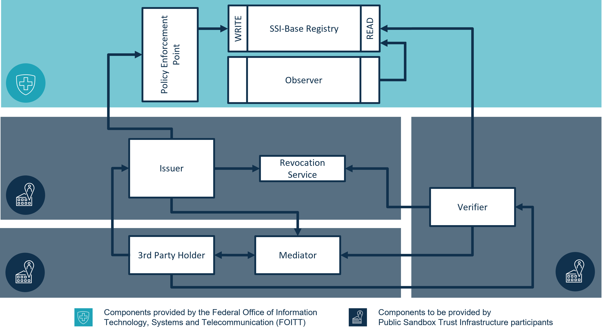

# Technical Integrator Factsheet

- [Technical Integrator Factsheet](#technical-integrator-factsheet)
  - [1. Introduction](#1-introduction)
    - [1.1. Purpose of this document](#11-purpose-of-this-document)
    - [1.2. Target audience](#12-target-audience)
    - [1.3. Requirements and Prerequisites](#13-requirements-and-prerequisites)
    - [1.4. Out of scope](#14-out-of-scope)
  - [2. The Public Sandbox Trust Infrastructure Environment](#2-the-public-sandbox-trust-infrastructure-environment)
    - [2.1. Overview](#21-overview)
    - [2.2. Components](#22-components)
      - [2.2.1. Base Registry](#221-base-registry)
        - [2.2.1.1. Genesis File](#2211-genesis-file)
      - [2.2.2. Policy Enforcement](#222-policy-enforcement)
        - [2.2.2.1. Policy Enforcement Rules](#2221-policy-enforcement-rules)
      - [2.2.3. Observer](#223-observer)
        - [2.2.3.1. Access / URL](#2231-access--url)
  - [3. Technical Onboarding Steps](#3-technical-onboarding-steps)
  - [4. Maintenance and Support](#4-maintenance-and-support)
    - [4.1. Maintenance Windows](#41-maintenance-windows)
    - [4.2. Communication Channels](#42-communication-channels)
    - [4.3. Support Template](#43-support-template)

## 1. Introduction

### 1.1. Purpose of this document

The purpose of this technical factsheet is to provide guidance on how to integrate solutions using the Public Sandbox Trust Infrastructure environment provided and operated by the FOITT. It will cover the technical architecture of the Public Sandbox Trust Infrastructure, the standards and protocols supported, and provide instructions for setting up and using the environment.

### 1.2. Target audience

This factsheet is intended for developers, solution architects and technical stakeholders.

### 1.3. Requirements and Prerequisites

Participation in the Public Sandbox Trust Infrastructure environment is currently limited to Swiss companies.

Before being able to gain technical access to the Public Sandbox Trust Infrastructure environment, an administrative onboarding process needs to be completed.
Please find more information here <http://e-id.ch>

To fully understand the contents of this document, it is essential that the reader has a solid understanding of the following topics:

- Self-Sovereign Identity (SSI) in general
- SSI core concepts such as decentralization, verifiability, privacy, trust and interoperability
- Hyperledger Indy, which is the specific SSI technology stack being used as the base registry for the first iteration of the Public Sandbox Trust Infrastructure environment  

Further, we introduced a logical partitioning to ensure a fair and compliant usage as well as manageability of participants.
We do call those partitions "business cases" and may refer to them as such in the technical documents.

### 1.4. Out of scope

> **New to the technology?**   
> If SSI is new to you the technology feel free to consult our detailed [sandbox cookbook](cookbook/README.md), which explains to you how to go to the onboarding process from a technical point-of-view

This document does not cover the following topics:

- Introduction to SSI concepts
- Introduction/comparison of SSI technology stacks
- Guidance related to the implementation of agents
- Description of possible use cases

## 2. The Public Sandbox Trust Infrastructure Environment

### 2.1. Overview

For this ecosystem we provide three essential systems to all participants:

- The base registry
- The policy enforcement point
- The observer  

Other systems, for example the holder-, issuing-, revocation-application, need to be provided by the business case itself.

We recommend that business cases collaborate and cooperate to develop a thriving ecosystem which can benefit from business case overarching interactions.

Every (active-) participant of the sandbox, like business case owners and issuers, has to be registered in our policy enforcement point to be linked to a business case.
To do this, you need agent-invitations, which will result from the administrative procedure and be transmitted to you by the FOITT.
Passive participants, such as verifiers, will not need such a connection and can read the information provided by the ledger directly by using the provided genesis file (Link).

The following diagram provides a graphical representation of the public sandbox (please note that only the systems marked are currently provided by the FOITT.).



### 2.2. Components

#### 2.2.1. Base Registry

For now, the base registry is an indy-ledger-node network which can be contacted by indy enabled agents.

##### 2.2.1.1. Genesis File

The current genesis file for agents to connect to the base registry can be downloaded here:

<https://github.com/e-id-admin/public-sandbox-trustinfrastructure/blob/main/pool_genesis>

`SHA512: 20dbd450ccf6c0f14f5aab3ddb5655d2b4976e099b745d27ce6a4388444c95754a6e1774529e100e538d9256f75d58994993d2706135ff764ebb34bcf49291f6`  
or copied here:

```json
{"reqSignature":{},"txn":{"data":{"data":{"alias":"node1","blskey":"4m2G2yjH8K2imHrgVXQfG8Mywjn3a1b6QqAVCdVrYetThANfHskNcK5kBPv7aYXaorXLW8TxEp1N2bxfGAHXMtW8dpihNCXx552MLn96TsAmqtwhbsWYxa7AdPJRWLVwSx8YjqLHKQqgzWGA7W93gLcWKdhcx8D3xteqiP2c3MuumBg","blskey_pop":"RNnDphUqBfDo9LdLFuP2uFNgMdjob6QPhXkWapDbuC3bHNw39NnfgaVRtxiX1hDC34qHuegjR7wRnUfCESNvxdG8AyAmBVzeQTj4gEzZTwR8SnFziiiKw73uTbuTJskKVBxGALhCTvxmgXZuhprEG7XhpZeymgUYPVgo4wnuA8JnLf","client_ip":"20.250.7.112","client_port":"9702","node_ip":"10.213.4.10","node_port":"9701","services":["VALIDATOR"]},"dest":"Dous5JgR7RnrHrKbwgMjPoZuAXBbP6J486dWt4qzSFtk"},"metadata":{"from":"QW4CqdGH5DuMGejo9tUtFF"},"type":"0"},"txnMetadata":{"seqNo":1,"txnId":"ca12f31b8cbf5f29e268ea64c20a37f3d50b539d891db0c3ebc7c0f66b1fb98a"},"ver":"1"}
{"reqSignature":{},"txn":{"data":{"data":{"alias":"node2","blskey":"2phPjCrB5xMcfn3EQpRjr7jw8CGQjRgJDwucChTcnJr7G2xz62KNbXdyC48VdmwadkoxzzeAXLxmhvmNvwYZdEUP3sXJUdtfooPUyDMthWXVcAGbWnxVRSiCmNRJqNbsG4G2HutNFP5wrwj739bZrfx2mmoDPKkfYqyhdxkpKFeTT2j","blskey_pop":"RWt7kgNN1Z4Gae6hVYH8vn8aYVKvjegj79k58hFk82gu2qgTP8biNp526ZecWsVf7rug2Gztx2HuYtpKaMvXpFg8mB2cF6akZJCeyr6ujdKRcVXCc6zjzWaSpTWrwDb9Adn3yez8GQGPbmXYoqnfawqSh9so52hzWzYAKRe4Ee5MNX","client_ip":"20.250.7.112","client_port":"9704","node_ip":"10.213.4.11","node_port":"9703","services":["VALIDATOR"]},"dest":"CogX6HqpMqq7iHjqjn1YH4ovCfKGAGrSQx8z9xqfKrmW"},"metadata":{"from":"NfDdRyyrMw6anw4gRwAJ8y"},"type":"0"},"txnMetadata":{"seqNo":2,"txnId":"15b18a7243257695704f66a3b1ddc9311194fc7d2e1896f440cc517c777ab7ec"},"ver":"1"}
{"reqSignature":{},"txn":{"data":{"data":{"alias":"node3","blskey":"PnBm4c9kzQgzLBqyTTZx1YEfZr1Kef9e5TKjFD4XZzexPgkvZXNv9vjSPwvLZz6buqLsNkFgvESh32qVyBG2NKCq41ijH4zorw1d23q6M3ewa9JSZEAKLqbxumPy4gyLs3ooTgnxEVm8AyzDKj2Gvr8xXtfwZLRUp4CtgoQxFMKYhY","blskey_pop":"QuSNr3WNUH3vLffsSwcpq7zFQh1YDmQqtvkyEHVCCjC9HMSReup1CSjtmx5pcbuK4zvwRAcjdMs666CGYH6aMUhbZn17NaS4BfbUGsrKUD1eiMJXHFqhkk7A7BrcuUvW3sNTCeWhbJX2rjEX6LZYPLq9Hy7DmhAZi18EyNXjM6drmu","client_ip":"20.250.7.112","client_port":"9706","node_ip":"10.213.4.12","node_port":"9705","services":["VALIDATOR"]},"dest":"3Nkg3PZVhvEyH1EN12SnqxSRpm2JZ4MyLRvJ4D1VRWCG"},"metadata":{"from":"5Mk37fABdc2E6TJJUy9qL1"},"type":"0"},"txnMetadata":{"seqNo":3,"txnId":"3b5bb1c6e7b76daba8afd89516e24140a67fc6be2ba071cc3b97d1b2e08c238d"},"ver":"1"}
```

#### 2.2.2. Policy Enforcement

> The  **endorser did** of the agent which the policy enforcement point uses is *8WzWX4G3Rti6tVSX3Atcvo*  
> How to use it is explained in the [sandbox cookbook](cookbook/README.md), which explains to you how credentials issuing works

To govern the public data written to the base registry all (ledger-) transactions need to be reviewed by our policy enforcement point.
Currently this consist of an acapy endorser system, an agent invitation to create a connection with this system will be sent to you after your access to the sandbox has been granted.
Please make sure your agent does adhere to AIP 1.0 as well as the endorsement protocol.

If your business case contains multiple issuers, please make sure to use the correct unique agent invitation for each agent.
Currently we do not enforce the hard link of DID and invitation. If there are irregularities over one connection, we might have to shut it down for the sake of fair use of the public sandbox.

##### 2.2.2.1. Policy Enforcement Rules

The following rules apply to all transactions sent to the policy enforcement point and may result in an automatic acceptance or rejection.

- a SCHEMA transaction can only be sent by an agent of the business case owner.
- a SCHEMA name is bound to a business case
  - Only  the business case owner agent can create new versions of the SCHEMA
- a CRED_DEF transaction will be accepted if the author DID is already registered in business case
- a REVOC_REG_DEF will be accepted if the author DID already has a CRED_DEF for the given SCHEMA
- a REVOC_REG_ENTRY will be accepted if the author DID already has a REVOC_REG_DEF for the given SCHEMA

Other transaction types are not automatically endorsed and may need manual appliance and interaction.
If you do wish to use other transaction types, please contact us (See 4.2 Communication Channels).

Condensed business case agent role overview:

| Tx Type         | Owner              | Issuer             |
| --------------- | ------------------ | ------------------ |
| SCHEMA          | :heavy_check_mark: | :x:                |
| CRED_DEF        | :x:                | :heavy_check_mark: |
| REVOC_REG_DEF   | :x:                | :heavy_check_mark: |
| REVOC_REG_ENTRY | :x:                | :heavy_check_mark: |

#### 2.2.3. Observer

##### 2.2.3.1. Access / URL

To enable participants to check/view transactions on the base registry in a user-friendly way, we provide a IndyScan instance. The observer is publicly accessible and requires no access credentials. It's accessible by using the following URL: <https://explorer.sandbox.ssi.ch>

Please keep in mind, that newly written transactions might need a moment until they show up on the observer, since they are fetched on a schedule. If you aren't able to see a recently written transaction, please try again after 2-3 minutes.

## 3. Technical Onboarding Steps

For this onboarding example we expect the following steps to already have been done:

- An agent for the business case owner has already been deployed (Will be referred to as A1)
- An agent for the issuer has already been deployed (Will be referred to as A2. Technically A1 and A2 could be the same agent as a single agent can fulfill both roles)
- The DIDs of both agents have already been approved by the administrative process

1. Accept agent invitation of business case owner in A1
    - set connection as endorsement connection up
1. Accept agent invitation of issuer in A2
    - set connection as endorsement connection up
1. Create SCHEMA transaction with A1
    - Send SCHEMA transaction to policy enforcement point
    - wait for endorsement
    - A1 writes endorsed SCHEMA transaction to ledger
1. Create CRED_DEF transaction with A2
    - Send transaction to policy enforcement point
    - wait for endorsement
    - A2 writes endorsed CRED_DEF transaction to ledger
1. If CRED_DEF was defined as revocable:
    - Create REVOC_REG_DEF transaction with A2
        - Send transaction to policy enforcement point
        - wait for endorsement
        - A2 writes endorsed REVOC_REG_DEF transaction to ledger
    - Create REVOC_REG_ENTRY transaction with A2
        - Send transaction to policy enforcement point
        - wait for endorsement
        - A2 writes endorsed REVOC_REG_ENTRY transaction to ledger
1. A2 may issue verifiable credentials to a passive participant
1. A2 may revoke a previously issued verifiable credential

## 4. Maintenance and Support

### 4.1. Maintenance Windows

Please note that our environment undergoes routine maintenance every week on Wednesday, from 09:00 to 11:00. This maintenance is necessary to ensure the stability and reliability of our environment. We recommend planning your work accordingly by scheduling important tasks or meetings that rely on the systems availability outside of this maintenance window. During this time, some or all components may be temporarily unavailable or experience degraded performance. Due to the nature of the environment, additional maintenance windows may be announced.

### 4.2. Communication Channels

In case you do have any questions, we kindly ask you to use our discussion forum first: <https://github.com/e-id-admin/public-sandbox-trustinfrastructure/discussions>

If your question could not be answered or may contain sensitive information, please send your support request to ssi-sandbox@bit.admin.ch.
Please keep in mind that identifying information or change actions to your business case may only be requested via IncaMail of the business case owner.

### 4.3. Support Template

In order to ensure a smooth and efficient process, we kindly ask you to provide the following information when submitting an email support request:

```text
Business Case UUID*: <please insert>
Transaction ID:  <please insert>

Problem description*:
 <please insert>

Steps to reproduce:
 <please insert>
```

*required data  
If you do have any logs or screenshots for us to understand the problem, please also include them in the email.


